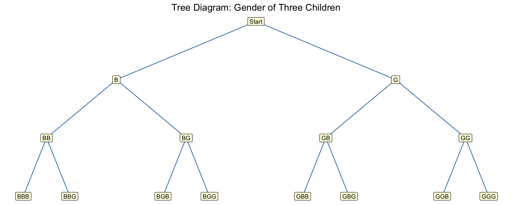
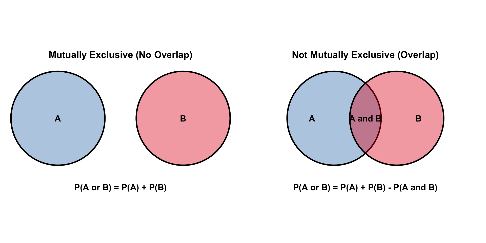

## Chapter Overview

**Chapter 4: Probability and Counting Rules**

Probability is the foundation of statistical inference. This chapter covers:

- **Section 4-1**: Sample Spaces and Probability
- **Section 4-2**: The Addition Rules for Probability
- **Section 4-3**: The Multiplication Rules and Conditional Probability
- **Section 4-4**: Counting Rules
- **Section 4-5**: Probability and Counting Rules

---

## Learning Objectives

By the end of this chapter, you will be able to:

1. Determine sample spaces and compute classical probability
2. Compute empirical probability using frequency distributions
3. Find the probability of compound events using the addition rules
4. Find the probability of compound events using the multiplication rules
5. Compute conditional probability
6. Find the total number of outcomes using the fundamental counting rule
7. Find the number of ways using the permutation rule
8. Find the number of ways using the combination rule

# Section 4-1: Sample Spaces and Probability {background-color="#2c4a6e"}

---

## Key Vocabulary

::: {.callout-note title="Probability Experiment"}
A **probability experiment** is a process that leads to well-defined results called **outcomes**.
:::

::: {.callout-note title="Sample Space and Events"}
- **Sample space** (*S*): the set of all possible outcomes of a probability experiment
- **Outcome**: a single result from one trial
- **Event** (*E*): one or more outcomes — a subset of the sample space
- **Simple event**: an event with exactly one outcome
- **Compound event**: an event with more than one outcome
:::

---

## Example 4-1: Rolling Two Dice

::: {.callout-tip title="Example 4-1 — Rolling Two Dice"}
Find the sample space for rolling two dice.
:::


::: {.cell}
::: {.cell-output .cell-output-stdout}

```
Total outcomes: 36 
```


:::

::: {.cell-output-display}


Table: Sample space for two dice (36 outcomes)

|         |Die2 = 1 |Die2 = 2 |Die2 = 3 |Die2 = 4 |Die2 = 5 |Die2 = 6 |
|:--------|:--------|:--------|:--------|:--------|:--------|:--------|
|Die1 = 1 |(1,1)    |(1,2)    |(1,3)    |(1,4)    |(1,5)    |(1,6)    |
|Die1 = 2 |(2,1)    |(2,2)    |(2,3)    |(2,4)    |(2,5)    |(2,6)    |
|Die1 = 3 |(3,1)    |(3,2)    |(3,3)    |(3,4)    |(3,5)    |(3,6)    |
|Die1 = 4 |(4,1)    |(4,2)    |(4,3)    |(4,4)    |(4,5)    |(4,6)    |
|Die1 = 5 |(5,1)    |(5,2)    |(5,3)    |(5,4)    |(5,5)    |(5,6)    |
|Die1 = 6 |(6,1)    |(6,2)    |(6,3)    |(6,4)    |(6,5)    |(6,6)    |


:::
:::


---

## Example 4-2: Drawing a Card

::: {.callout-tip title="Example 4-2 — Drawing a Card"}
Find the sample space for drawing one card from an ordinary deck.
:::


::: {.cell}
::: {.cell-output .cell-output-stdout}

```
Total cards in sample space: 52 
```


:::

::: {.cell-output .cell-output-stdout}

```
First 8 cards shown:
```


:::

::: {.cell-output .cell-output-stdout}

```
[1] "A Hearts" "2 Hearts" "3 Hearts" "4 Hearts" "5 Hearts" "6 Hearts" "7 Hearts"
[8] "8 Hearts"
```


:::
:::


---

## Example 4-3: Gender of Three Children

::: {.callout-tip title="Example 4-3 — Gender of Three Children"}
Find the sample space for a family with three children, where the gender of each child is recorded.
:::


::: {.cell}
::: {.cell-output .cell-output-stdout}

```
Sample space ( 8 outcomes ):
```


:::

::: {.cell-output .cell-output-stdout}

```
[1] "BBB" "GBB" "BGB" "GGB" "BBG" "GBG" "BGG" "GGG"
```


:::
:::


---

## Example 4-4: Tree Diagram — Gender of Children

::: {.callout-tip title="Example 4-4 — Tree Diagram"}
Draw a tree diagram for the gender of three children.
:::


::: {.cell}
::: {.cell-output-display}
{width=960}
:::
:::


---

## Classical Probability

::: {.callout-note title="Classical Probability"}
When all outcomes in the sample space are **equally likely**:

$$P(E) = \frac{n(E)}{n(S)} = \frac{\text{number of outcomes in event } E}{\text{total outcomes in sample space}}$$
:::

::: {.callout-important title="Probability Rules"}
1. $0 \leq P(E) \leq 1$ for any event $E$
2. $P(S) = 1$ (sum of all outcomes = 1)
3. $P(\emptyset) = 0$ (impossible event)
4. $\sum P(E_i) = 1$ for all simple events
:::

---

## Example 4-5: Drawing a Card

::: {.callout-tip title="Example 4-5 — Drawing a Card"}
A card is drawn from a standard 52-card deck. Find the probability of getting a black 10.
:::


::: {.cell}
::: {.cell-output .cell-output-stdout}

```
P(black 10) = 2 / 52 = 0.0385 = 1/26
```


:::
:::


**Solution:** There are 2 black 10s (10 of clubs, 10 of spades) in a 52-card deck.
$$P(\text{black 10}) = \frac{2}{52} = \frac{1}{26}$$

---

## Example 4-6: Gender of Children

::: {.callout-tip title="Example 4-6 — Gender of Children"}
If a family has three children, find the probability of having exactly two girls.
:::


::: {.cell}
::: {.cell-output .cell-output-stdout}

```
Sample space: BBB, GBB, BGB, GGB, BBG, GBG, BGG, GGG 
```


:::

::: {.cell-output .cell-output-stdout}

```
Outcomes with exactly 2 girls: GGB, GBG, BGG 
```


:::

::: {.cell-output .cell-output-stdout}

```
P(exactly 2 girls) = 3 / 8 = 0.375 
```


:::
:::


---

## Example 4-7: Drawing a Card — Multiple Events

::: {.callout-tip title="Example 4-7 — Drawing a Card"}
A card is drawn from a standard deck. Find the probability of:

- (a) a jack, 

- (b) the 6 of clubs, 

- (c) a 3 or a diamond, 

- (d) a 3 or a 6.
:::

---


::: {.cell}
::: {.cell-output .cell-output-stdout}

```
(a) P(jack)          = 0.07692308 = 4/52 = 1/13
```


:::

::: {.cell-output .cell-output-stdout}

```
(b) P(6 of clubs)    = 0.01923077 = 1/52
```


:::

::: {.cell-output .cell-output-stdout}

```
(c) P(3 or diamond)  = 0.3076923 = 16/52 = 4/13
```


:::

::: {.cell-output .cell-output-stdout}

```
(d) P(3 or 6)        = 0.1538462 = 8/52 = 2/13
```


:::
:::


---

## Examples 4-8 & 4-9: Impossible and Certain Events

::: {.callout-tip title="Example 4-8 — Impossible Event"}
When a single die is rolled, find the probability of getting a 9.
:::

$$P(9) = \frac{0}{6} = 0$$

::: {.callout-tip title="Example 4-9 — Certain Event"}
When a single die is rolled, find the probability of getting a number less than 7.
:::

$$P(\text{number} < 7) = \frac{6}{6} = 1$$

---

## Complementary Events

::: {.callout-note title="Complement Rule"}
The **complement** of event $E$, denoted $\bar{E}$, consists of all outcomes **not** in $E$.

$$P(\bar{E}) = 1 - P(E)$$
:::

---

## Example 4-10: Finding Complements

::: {.callout-tip title="Example 4-10 — Finding Complements"}
Find the complement of each event:

- (a) Rolling a die and getting a 4

- (b) Selecting a month and getting a month with 31 days

- (c) Selecting a day and getting a weekday
:::


::: {.cell}
::: {.cell-output .cell-output-stdout}

```
(a) Complement of getting a 4: {1, 2, 3, 5, 6}
```


:::

::: {.cell-output .cell-output-stdout}

```
(b) Complement of 31-day month: { Feb, Apr, Jun, Sep, Nov }
```


:::

::: {.cell-output .cell-output-stdout}

```
(c) Complement of weekday: {Saturday, Sunday}
```


:::
:::


---

## Example 4-11: Residence

::: {.callout-tip title="Example 4-11 — Residence"}
If the probability that a person lives in an industrialized country is 1/5, find the probability that a person does **not** live in an industrialized country.
:::


::: {.cell}
::: {.cell-output .cell-output-stdout}

```
P(industrialized) = 0.2 
```


:::

::: {.cell-output .cell-output-stdout}

```
P(not industrialized) = 1 - 0.2 = 0.8 
```


:::
:::


---

## Example 4-12: Travel Survey

::: {.callout-tip title="Example 4-12 — Travel Survey"}
In a survey, 3 out of 25 people said they traveled by airplane in the past year. Find the probability that a randomly selected person has **not** flown in the past year.
:::


::: {.cell}
::: {.cell-output .cell-output-stdout}

```
P(fly) = 0.12 
```


:::

::: {.cell-output .cell-output-stdout}

```
P(not fly) = 1 - 0.12 = 0.88 = 22 / 25 
```


:::
:::


---

## Empirical Probability

::: {.callout-note title="Empirical Probability"}
**Empirical (relative frequency) probability** is based on observed data:

$$P(E) = \frac{\text{frequency of event } E}{\text{total frequencies}} = \frac{f}{n}$$
:::

---

## Example 4-13: Blood Types

::: {.callout-tip title="Example 4-13 — Blood Types"}
In a sample of 50 people, 21 had type O blood, 22 type A, 5 type B, and 2 type AB. Find the probability that a randomly selected person has type O or type B.
:::


::: {.cell}
::: {.cell-output-display}


Table: Blood Type Distribution (n=50)

|Blood Type | Frequency| Relative Frequency|
|:----------|---------:|------------------:|
|O          |        21|               0.42|
|A          |        22|               0.44|
|B          |         5|               0.10|
|AB         |         2|               0.04|


:::

::: {.cell-output .cell-output-stdout}

```

P(type O) = 0.42 
```


:::

::: {.cell-output .cell-output-stdout}

```
P(type B) = 0.1 
```


:::

::: {.cell-output .cell-output-stdout}

```
P(O or B) = 0.52 
```


:::
:::


---

## Example 4-14: Hospital Stays

::: {.callout-tip title="Example 4-14 — Hospital Stays"}
The following distribution shows the number of days 127 maternity patients stayed in the hospital. Find the probability that a patient stayed: 

- (a) exactly 4 days, 

- (b) at most 4 days, 

- (c) at least 5 days.
:::

----


::: {.cell}
::: {.cell-output-display}


Table: Hospital Stay Distribution (n=127)

| Days| Frequency|   P(X)|
|----:|---------:|------:|
|    3|        15| 0.1181|
|    4|        32| 0.2520|
|    5|        56| 0.4409|
|    6|        19| 0.1496|
|    7|         5| 0.0394|


:::

::: {.cell-output .cell-output-stdout}

```
(a) P(exactly 4 days) = 0.252 
```


:::

::: {.cell-output .cell-output-stdout}

```
(b) P(at most 4 days) = 0.3701 
```


:::

::: {.cell-output .cell-output-stdout}

```
(c) P(at least 5 days)= 0.6299 
```


:::
:::


---

## Types of Probability

::: {.callout-note title="Three Types of Probability"}
| Type | Definition | Example |
|---|---|---|
| **Classical** | Equal outcomes; based on theory | Rolling a fair die |
| **Empirical** | Based on observation/experiment | Frequency survey data |
| **Subjective** | Based on educated guess | Weather forecast |
:::

::: {.callout-important title="Law of Large Numbers"}
As the number of trials of an experiment increases, the **empirical probability** approaches the **theoretical (classical) probability**.
:::

# Section 4-2: The Addition Rules for Probability {background-color="#2c4a6e"}

---

## Mutually Exclusive Events

::: {.callout-note title="Mutually Exclusive Events"}
Two events $A$ and $B$ are **mutually exclusive** if they **cannot occur at the same time** — they share no outcomes in common.
:::

::: {.callout-note title="Addition Rule 1 — Mutually Exclusive Events"}
When two events $A$ and $B$ are mutually exclusive:
$$P(A \text{ or } B) = P(A) + P(B)$$
:::

::: {.callout-note title="Addition Rule 2 — Non-Mutually Exclusive Events"}
When $A$ and $B$ are **not** mutually exclusive:
$$P(A \text{ or } B) = P(A) + P(B) - P(A \text{ and } B)$$
:::

---

## Example 4-15: Rolling a Die — Mutual Exclusivity

::: {.callout-tip title="Example 4-15 — Rolling a Die"}
Determine which pairs of events are mutually exclusive when a single die is rolled:

- (a) odd number and even number; 

- (b) getting a 3 and getting an odd number;

- (c) odd number and number less than 4; 

- (d) number greater than 4 and number less than 4.
:::


::: {.cell}
::: {.cell-output .cell-output-stdout}

```
(a) Odd: 1 3 5 | Even: 2 4 6 | Overlap:  → MUTUALLY EXCLUSIVE
```


:::

::: {.cell-output .cell-output-stdout}

```
(b) {3} vs Odd: 1 3 5 | Overlap: 3 → NOT mutually exclusive
```


:::

::: {.cell-output .cell-output-stdout}

```
(c) Odd: 1 3 5 vs <4: 1 2 3 | Overlap: 1 3 → NOT mutually exclusive
```


:::

::: {.cell-output .cell-output-stdout}

```
(d) >4: 5 6 vs <4: 1 2 3 | Overlap:  → MUTUALLY EXCLUSIVE
```


:::
:::


---

## Example 4-16: Drawing a Card — Mutual Exclusivity

::: {.callout-tip title="Example 4-16 — Drawing a Card"}
Determine which events are mutually exclusive when drawing one card:

- (a) 7 and jack; 

- (b) club and king; 

- (c) face card and ace; 

- (d) face card and spade.
:::


::: {.cell}
::: {.cell-output .cell-output-stdout}

```
(a) Getting a 7 AND a jack: cannot both be on one card → MUTUALLY EXCLUSIVE
```


:::

::: {.cell-output .cell-output-stdout}

```
(b) Getting a club AND a king: king of clubs exists → NOT mutually exclusive
```


:::

::: {.cell-output .cell-output-stdout}

```
(c) Face card AND ace: aces are not face cards → MUTUALLY EXCLUSIVE
```


:::

::: {.cell-output .cell-output-stdout}

```
(d) Face card AND spade: jack/queen/king of spades exist → NOT mutually exclusive
```


:::
:::


---

## Example 4-17: Coffee Shop Selection

::: {.callout-tip title="Example 4-17 — Coffee Shop Selection"}
A city has 9 coffee shops: 3 Starbucks, 2 Caribou Coffees, and 4 Crazy Mocha Coffees. Find the probability that a randomly selected shop is either a Starbucks or a Crazy Mocha.
:::


::: {.cell}
::: {.cell-output .cell-output-stdout}

```
P(Starbucks or Crazy Mocha) = P(Starbucks) + P(Crazy Mocha)
```


:::

::: {.cell-output .cell-output-stdout}

```
                            = 0.3333333 + 0.4444444 = 0.7777778 = 7/9
```


:::
:::


---

## Example 4-18: R&D Employees

::: {.callout-tip title="Example 4-18 — R&D Employees"}
Three companies have R&D centers with 110 (US Steel), 750 (Alcoa), and 250 (Bayer) employees. Find the probability that a randomly selected employee works at US Steel or Alcoa.
:::


::: {.cell}
::: {.cell-output .cell-output-stdout}

```
Total employees: 1110 
```


:::

::: {.cell-output .cell-output-stdout}

```
P(US Steel or Alcoa) = 110 + 750 / 1110 = 0.7747748 
```


:::

::: {.cell-output .cell-output-stdout}

```
                     = 860/1110 = 86/111 ≈ 0.7748 
```


:::
:::


---

## Example 4-19: Day of the Week

::: {.callout-tip title="Example 4-19 — Day of the Week"}
A day is selected at random. Find the probability that it is a weekend day.
:::


::: {.cell}
::: {.cell-output .cell-output-stdout}

```
P(Saturday or Sunday) = 1/7 + 1/7 = 0.2857143 = 2/7
```


:::
:::


---

## Example 4-20: Drawing a Card (Non-Mutually Exclusive)

::: {.callout-tip title="Example 4-20 — Drawing a Card"}
Find the probability that a single card drawn from a deck is either an ace or a black card.
:::


::: {.cell}
::: {.cell-output .cell-output-stdout}

```
Aces: 4 | Black cards: 26 | Black aces: 2 
```


:::

::: {.cell-output .cell-output-stdout}

```
P(ace or black) = 4/52 + 26/52 - 2/52 = 0.5384615 = 28/52 = 7/13
```


:::
:::


---

## Example 4-21: Medical Staff

::: {.callout-tip title="Example 4-21 — Selecting a Medical Staff Person"}
A hospital unit has 8 nurses and 5 physicians; 7 nurses and 3 physicians are female. Find the probability that a randomly selected staff member is a nurse or male.
:::


::: {.cell}
::: {.cell-output-display}


Table: Hospital Staff Composition

|Staff      | Female| Male| Total|
|:----------|------:|----:|-----:|
|Nurses     |      7|    1|     8|
|Physicians |      3|    2|     5|
|Total      |     10|    3|    13|


:::

::: {.cell-output .cell-output-stdout}

```

P(nurse or male) = P(nurse) + P(male) - P(male nurse)
```


:::

::: {.cell-output .cell-output-stdout}

```
                 = 8/13 + 3/13 - 1/13 = 0.7692308 = 10/13
```


:::
:::


---

## Example 4-22: Driving While Intoxicated

::: {.callout-tip title="Example 4-22 — Driving While Intoxicated"}
P(driving while intoxicated) = 0.32, P(having an accident) = 0.09, P(intoxicated and accident) = 0.06. Find P(intoxicated or accident).
:::


::: {.cell}
::: {.cell-output .cell-output-stdout}

```
P(intoxicated or accident) = P(intox) + P(acc) - P(both)
```


:::

::: {.cell-output .cell-output-stdout}

```
                           = 0.32 + 0.09 - 0.06 = 0.35 
```


:::
:::


---

## Venn Diagrams for Addition Rules


::: {.cell}
::: {.cell-output-display}
{width=960}
:::
:::


# Section 4-3: The Multiplication Rules and Conditional Probability {background-color="#2c4a6e"}

---

## Independent and Dependent Events

::: {.callout-note title="Independent Events"}
Two events $A$ and $B$ are **independent** if the occurrence of $A$ does **not** affect the probability of $B$ occurring.
:::

::: {.callout-note title="Multiplication Rule 1 — Independent Events"}
$$P(A \text{ and } B) = P(A) \cdot P(B)$$

For multiple independent events: $P(A_1 \text{ and } A_2 \cdots \text{ and } A_k) = P(A_1) \cdot P(A_2) \cdots P(A_k)$
:::

---

## Example 4-23: Tossing a Coin and Rolling a Die

::: {.callout-tip title="Example 4-23 — Tossing a Coin"}
A coin is flipped and a die is rolled. Find P(head and 4).
:::


::: {.cell}
::: {.cell-output .cell-output-stdout}

```
P(head and 4) = P(head) × P(4) = 0.5 × 0.1666667 = 0.08333333 = 1/12
```


:::

::: {.cell-output .cell-output-stdout}

```
P from sample space: 0.08333333 
```


:::
:::


---

## Example 4-24: Drawing a Card (with Replacement)

::: {.callout-tip title="Example 4-24 — Drawing a Card"}
A card is drawn from a deck and replaced; then a second card is drawn. Find P(queen and then ace).
:::


::: {.cell}
::: {.cell-output .cell-output-stdout}

```
P(queen then ace) = P(queen) × P(ace) = 0.07692308 × 0.07692308 
```


:::

::: {.cell-output .cell-output-stdout}

```
                  = 0.00591716 = 16/2704 = 1/169
```


:::
:::


---

## Example 4-25: Selecting Colored Balls (with Replacement)

::: {.callout-tip title="Example 4-25 — Colored Balls"}
An urn contains 3 red, 2 blue, and 5 white balls. A ball is selected, noted, and replaced. A second is selected. Find: 

1. P(2 blue), 

2. P(blue then white), 

3. P(red then blue).
:::


::: {.cell}
::: {.cell-output .cell-output-stdout}

```
1. P(blue and blue)  = 0.2 × 0.2 = 0.04 = 4/100 = 1/25
```


:::

::: {.cell-output .cell-output-stdout}

```
2. P(blue and white) = 0.2 × 0.5 = 0.1 = 1/10
```


:::

::: {.cell-output .cell-output-stdout}

```
3. P(red and blue)   = 0.3 × 0.2 = 0.06 = 6/100 = 3/50
```


:::
:::


---

## Example 4-26: Survey on Stress

::: {.callout-tip title="Example 4-26 — Survey on Stress"}
A Harris poll found that 46% of Americans suffer great stress at least once a week. If 3 people are randomly selected, find the probability that all 3 experience great stress at least once a week.
:::


::: {.cell}
::: {.cell-output .cell-output-stdout}

```
P(S and S and S) = (0.46)³ = 0.0973 ≈ 0.097
```


:::
:::


---

## Example 4-27: Color Blindness

::: {.callout-tip title="Example 4-27 — Male Color Blindness"}
About 9% of men have red-green color blindness. If 3 men are randomly selected, find the probability that all three are color-blind.
:::


::: {.cell}
::: {.cell-output .cell-output-stdout}

```
P(all 3 color blind) = (0.09)³ = 0.000729 ≈ 0.0007
```


:::
:::


---

## Dependent Events

::: {.callout-note title="Dependent Events"}
When the outcome or probability of the **first event affects** the probability of the **second event**, the events are **dependent**.
:::

::: {.callout-note title="Multiplication Rule 2 — Dependent Events"}
$$P(A \text{ and } B) = P(A) \cdot P(B|A)$$

where $P(B|A)$ is the conditional probability of $B$ given $A$ has occurred.
:::

---

## Example 4-28: University Crime

::: {.callout-tip title="Example 4-28 — University Crime"}
A university had 5 burglaries in 2003, 16 in 2004, and 32 in 2005. A researcher selects 2 cases at random to investigate; find the probability both occurred in 2004.
:::


::: {.cell}
::: {.cell-output .cell-output-stdout}

```
Total burglaries: 53 
```


:::

::: {.cell-output .cell-output-stdout}

```
P(both in 2004) = 16/53 × 15/52 = 0.0871 = 60/689
```


:::
:::


---

## Example 4-29: Homeowner's and Auto Insurance

::: {.callout-tip title="Example 4-29 — Insurance"}
53% of city residents have homeowner's insurance (H), and 27% of those also have auto insurance (A) with the same company. Find P(H and A).
:::


::: {.cell}
::: {.cell-output .cell-output-stdout}

```
P(H and A) = P(H) × P(A|H) = 0.53 × 0.27 = 0.1431 
```


:::
:::


---

## Example 4-30: Drawing Cards (without Replacement)

::: {.callout-tip title="Example 4-30 — Drawing Cards"}
Three cards are drawn from a deck without replacement. Find: 

1. P(3 jacks), 

2. P(ace, king, queen in order),

3. P(club, spade, heart in order), 

4. P(3 clubs).
:::


::: {.cell}
::: {.cell-output .cell-output-stdout}

```
1. P(3 jacks)  = 4/52 × 3/51 × 2/50 = 0.000181 = 1/5525
```


:::

::: {.cell-output .cell-output-stdout}

```
2. P(A,K,Q)    = 4/52 × 4/51 × 4/50 = 0.000483 = 8/16575
```


:::

::: {.cell-output .cell-output-stdout}

```
3. P(C,S,H)    = 13/52 × 13/51 × 13/50 = 0.016569 = 169/10200
```


:::

::: {.cell-output .cell-output-stdout}

```
4. P(3 clubs)  = 13/52 × 12/51 × 11/50 = 0.012941 = 11/850
```


:::
:::


---

## Example 4-31: Selecting Colored Balls (Tree Diagram)

::: {.callout-tip title="Example 4-31 — Selecting Colored Balls"}
Box 1 has 2 red and 1 blue ball. Box 2 has 3 blue and 1 red ball. A coin is tossed: heads → Box 1; tails → Box 2. A ball is drawn. Find P(red).
:::


::: {.cell}
::: {.cell-output .cell-output-stdout}

```
P(red) = P(Box1)×P(R|B1) + P(Box2)×P(R|B2)
```


:::

::: {.cell-output .cell-output-stdout}

```
       = 0.5 × 0.6666667 + 0.5 × 0.25 
```


:::

::: {.cell-output .cell-output-stdout}

```
       = 0.3333333 + 0.125 = 0.4583333 = 11/24
```


:::
:::


---

## Conditional Probability

::: {.callout-note title="Conditional Probability Formula"}
The **conditional probability** of event $B$ given event $A$ has occurred:

$$P(B|A) = \frac{P(A \text{ and } B)}{P(A)}$$
:::

---

## Example 4-32: Selecting Colored Chips

::: {.callout-tip title="Example 4-32 — Colored Chips"}
P(black chip and white chip) = 15/56. P(black chip on first draw) = 3/8. Find P(white | black first).
:::


::: {.cell}
::: {.cell-output .cell-output-stdout}

```
P(W|B) = P(B and W) / P(B) = 0.2678571 / 0.375 = 0.7142857 = 5/7
```


:::
:::


---

## Example 4-33: Parking Tickets

::: {.callout-tip title="Example 4-33 — Parking Tickets"}
P(parks in no-parking zone and gets ticket) = 0.06. P(parks in no-parking zone) = 0.20. Find P(ticket | parks in no-parking zone).
:::


::: {.cell}
::: {.cell-output .cell-output-stdout}

```
P(T|N) = P(N and T)/P(N) = 0.06 / 0.2 = 0.3 
```


:::
:::


---

## Example 4-34: Women in the Military Survey

::: {.callout-tip title="Example 4-34 — Survey on Women in Military"}
A survey of 100 people asked if women should serve in combat. Results:

| | Yes | No | Total |
|--|--|--|--|
| Male | 32 | 18 | 50 |
| Female | 8 | 42 | 50 |
| **Total** | 40 | 60 | 100 |

Find: 

1. P(yes | female),

2. P(male | no).
:::


::: {.cell}
::: {.cell-output .cell-output-stdout}

```
1. P(Yes | Female) = 18 / 60 = 0.3 = 4/25
```


:::

::: {.cell-output .cell-output-stdout}

```
2. P(Male | No)    = 8 / 50 = 0.16 = 3/10
```


:::
:::


---

## Probabilities for "At Least"

::: {.callout-important title="At Least Strategy"}
For "at least one" problems, use the complement:
$$P(\text{at least one}) = 1 - P(\text{none})$$
:::

---

## Example 4-35: Drawing Cards — At Least One Ace

::: {.callout-tip title="Example 4-35 — Drawing Cards"}
A game draws 4 cards with replacement. Find P(at least 1 ace).
:::


::: {.cell}
::: {.cell-output .cell-output-stdout}

```
P(no ace in 4 draws) = (48/52)⁴ = 0.726 
```


:::

::: {.cell-output .cell-output-stdout}

```
P(at least 1 ace)    = 1 - 0.726 = 0.274 
```


:::
:::


---

## Example 4-36: Tossing Coins

::: {.callout-tip title="Example 4-36 — Tossing Coins"}
A coin is tossed 5 times. Find P(at least 1 tail).
:::


::: {.cell}
::: {.cell-output .cell-output-stdout}

```
P(all heads) = (1/2)⁵ = 0.03125 = 1/32
```


:::

::: {.cell-output .cell-output-stdout}

```
P(at least 1 tail) = 1 - 1/32 = 0.96875 = 31/32
```


:::
:::


---

## Example 4-37: Bow Ties

::: {.callout-tip title="Example 4-37 — Bow Ties"}
3% of ties sold are bow ties. If 4 customers who bought a tie are selected, find P(at least 1 bought a bow tie).
:::


::: {.cell}
::: {.cell-output .cell-output-stdout}

```
P(no bow ties) = (0.97)⁴ = 0.8853 
```


:::

::: {.cell-output .cell-output-stdout}

```
P(at least 1 bow tie) = 1 - 0.8853 = 0.1147 
```


:::
:::


# Section 4-4: Counting Rules {background-color="#2c4a6e"}

---

## Three Counting Rules

::: {.callout-note title="Three Counting Rules"}
To determine the total number of possible outcomes:

1. **Fundamental Counting Rule**: multiply the number of choices at each step

2. **Permutation Rule**: arrangements where **order matters**

3. **Combination Rule**: selections where **order does not matter**
:::

::: {.callout-note title="Fundamental Counting Rule"}
In a sequence of $n$ events where the first has $k_1$ possibilities, the second $k_2$, etc.:
$$\text{Total outcomes} = k_1 \cdot k_2 \cdot k_3 \cdots k_n$$
:::

---

## Example 4-38: Tossing a Coin and Rolling a Die

::: {.callout-tip title="Example 4-38 — Coin and Die"}
A coin is tossed and a die is rolled. Find the total number of outcomes.
:::


::: {.cell}
::: {.cell-output .cell-output-stdout}

```
Total outcomes = 2 × 6 = 12 
```


:::

::: {.cell-output .cell-output-stdout}

```
Sample space: H1, T1, H2, T2, H3, T3, H4, T4, H5, T5, H6, T6 
```


:::
:::


---

## Example 4-39: Types of Paint

::: {.callout-tip title="Example 4-39 — Types of Paint"}
A paint manufacturer offers 7 colors, 2 types (latex/oil), 3 textures (flat/semigloss/high gloss), and 2 uses (outdoor/indoor). How many different paints can be made?
:::


::: {.cell}
::: {.cell-output .cell-output-stdout}

```
Total paints = 7 × 2 × 3 × 2 = 84 
```


:::
:::


---

## Example 4-40: Blood Type Labeling

::: {.callout-tip title="Example 4-40 — Blood Types"}
Blood can be typed as A, B, AB, or O; Rh+ or Rh−; and gender (M or F). How many different labels are possible?
:::


::: {.cell}
::: {.cell-output .cell-output-stdout}

```
Total labels = 4 × 2 × 2 = 16 
```


:::

::: {.cell-output .cell-output-stdout}

```
Example labels: A+M B+M AB+M O+M 
```


:::
:::


---

## Example 4-41: Identification Cards

::: {.callout-tip title="Example 4-41 — Identification Cards"}
A store uses four-digit ID cards with digits 1–6. How many different cards are possible if repetition is

1. permitted, 

2. not permitted?
:::


::: {.cell}
::: {.cell-output .cell-output-stdout}

```
1. With repetition:    6 × 6 × 6 × 6 = 1296 
```


:::

::: {.cell-output .cell-output-stdout}

```
2. Without repetition: 6 × 5 × 4 × 3 = 360 
```


:::
:::


---

## Factorial Notation and Permutations

::: {.callout-note title="Factorial Notation"}
$$n! = n \cdot (n-1) \cdot (n-2) \cdots 1 \qquad \text{and} \qquad 0! = 1$$
:::

::: {.callout-note title="Permutation Rule"}
An arrangement of $n$ objects taking $r$ at a time (order matters):
$$_nP_r = \frac{n!}{(n-r)!}$$
:::

---

## Example 4-42: Business Location

::: {.callout-tip title="Example 4-42 — Business Location"}
A business owner ranks all 5 locations. How many different rankings are possible?
:::


::: {.cell}
::: {.cell-output .cell-output-stdout}

```
5! = 5 × 4 × 3 × 2 × 1 = 120 different rankings
```


:::

::: {.cell-output .cell-output-stdout}

```
Using permutation: ₅P₅ = 120 
```


:::
:::


::: {.cell}
::: {.cell-output .cell-output-stdout}

```
[1] 120
```


:::
:::


---

## Example 4-43 & 4-44: Permutations

::: {.callout-tip title="Example 4-43 & 4-44: Permutations"}
1. How many ways to rank the top 3 of 5 locations?

2. The advertising director for a television show has 7 ads to use on the program. If she selects 1 of them for the opening of the show, 1 for the middle of the show, and 1 for the ending of the show, how many possible ways can this be accomplished?
:::


::: {.cell}
::: {.cell-output .cell-output-stdout}

```

Example 4-43: ₅P₃ = 5!/(5-3)! = 5!/2! = 60 
```


:::

::: {.cell-output .cell-output-stdout}

```

Example 4-44: ₇P₃ = 7!/(7-3)! = 210 ways to place 3 of 7 ads
```


:::
:::


::: {.cell}

```{.r .cell-code}
# Example 4-43
n <- 5; r <- 3
factorial(n) / factorial(n-r)
```

::: {.cell-output .cell-output-stdout}

```
[1] 60
```


:::

```{.r .cell-code}
# Example 4-44: TV ads
n2 <- 7; r2 <- 3
factorial(n2) / factorial(n2-r2)
```

::: {.cell-output .cell-output-stdout}

```
[1] 210
```


:::
:::


---

## Example 4-45: School Musical Plays

::: {.callout-tip title="Example 4-45 — School Musical Plays"}
A director selects 2 of 9 plays — one for fall, one for spring. How many arrangements are possible?
:::


::: {.cell}
::: {.cell-output .cell-output-stdout}

```
₉P₂ = 9!/(9-2)! = 9!/7! = 72 different arrangements
```


:::
:::


::: {.cell}

```{.r .cell-code}
n <- 9; r <- 2
factorial(n) / factorial(n-r)
```

::: {.cell-output .cell-output-stdout}

```
[1] 72
```


:::
:::


---

## Combinations

::: {.callout-note title="Combination Rule"}
A selection of $r$ objects from $n$ objects where **order does not matter**:
$$_nC_r = \frac{n!}{(n-r)!\, r!}$$
:::

**Key distinction:** In a **permutation**, AB ≠ BA. In a **combination**, AB = BA.

---

## Example 4-46: Letters — Permutations vs. Combinations

::: {.callout-tip title="Example 4-46 — Letters A, B, C, D"}
List permutations and combinations of selecting 2 letters from {A, B, C, D}.
:::


::: {.cell}
::: {.cell-output .cell-output-stdout}

```
Permutations ( 12 ): BA, CA, DA, AB, CB, DB, AC, BC, DC, AD, BD, CD 
```


:::

::: {.cell-output .cell-output-stdout}

```
Combinations ( 6 ): AB, AC, AD, BC, BD, CD 
```


:::
:::


::: {.cell}

```{.r .cell-code}
n <- 4; r <- 2
factorial(n) / factorial(n-r)
```

::: {.cell-output .cell-output-stdout}

```
[1] 12
```


:::
:::


::: {.cell}

```{.r .cell-code}
n <- 4; r <- 2
factorial(n) / factorial(n-r) / factorial(r)
```

::: {.cell-output .cell-output-stdout}

```
[1] 6
```


:::
:::


---

## Examples 4-47 & 4-48: Combination Calculations

::: {.callout-tip title="Example 4-47 — Combinations"}
1. How many combinations of 4 objects taken 2 at a time?

2. A newspaper editor has received 8 books to review. He decides that he can use 3 reviews in his newspaper. How many different ways can these 3 reviews be selected?
:::


::: {.cell}
::: {.cell-output .cell-output-stdout}

```
Example 4-47:
```


:::

::: {.cell-output .cell-output-stdout}

```
₄C₂ = 4!/(4-2)!2! = 4!/(2!2!) = 6 
```


:::

::: {.cell-output .cell-output-stdout}

```
Example 4-48: A newspaper editor has 8 books; selects 3 to review.
```


:::

::: {.cell-output .cell-output-stdout}

```
₈C₃ = 8!/(8-3)!3! = 8!/(5!3!) = 56 
```


:::
:::


::: {.cell}

```{.r .cell-code}
# Example 4-47
choose(4,2)
```

::: {.cell-output .cell-output-stdout}

```
[1] 6
```


:::

```{.r .cell-code}
# Example 4-48
choose(8,3)
```

::: {.cell-output .cell-output-stdout}

```
[1] 56
```


:::
:::


---

## Example 4-49: Committee Selection

::: {.callout-tip title="Example 4-49 — Committee Selection"}
A club has 7 women and 5 men. A committee of 3 women and 2 men is to be formed. How many possibilities are there?
:::


::: {.cell}
::: {.cell-output .cell-output-stdout}

```
Choose 3 women from 7: ₇C₃ = 35 
```


:::

::: {.cell-output .cell-output-stdout}

```
Choose 2 men from 5:   ₅C₂ = 10 
```


:::

::: {.cell-output .cell-output-stdout}

```
Total = ₇C₃ × ₅C₂ = 35 × 10 = 350 
```


:::
:::


::: {.cell}

```{.r .cell-code}
choose(7, 3)*choose(5, 2)
```

::: {.cell-output .cell-output-stdout}

```
[1] 350
```


:::
:::


---

## Summary: Counting Rules


::: {.cell}
::: {.cell-output-display}


Table: Summary of Counting Rules

|Rule                 |When.to.Use                      |Formula             |
|:--------------------|:--------------------------------|:-------------------|
|Fundamental Counting |Sequence of independent choices  |k₁ × k₂ × ··· × kₙ  |
|Permutation          |Arrangement, order matters       |ₙPᵣ = n!/(n-r)!     |
|Combination          |Selection, order does NOT matter |ₙCᵣ = n!/[(n-r)!r!] |


:::
:::


# Section 4-5: Probability and Counting Rules {background-color="#2c4a6e"}

---

## Combining Counting and Probability

::: {.callout-important title="Strategy"}
Use counting rules to determine the number of outcomes in the **event** and in the **sample space**, then apply the classical probability formula:
$$P(E) = \frac{n(E)}{n(S)}$$
:::

---

## Example 4-50: Four Aces

::: {.callout-tip title="Example 4-50 — Four Aces"}
Find the probability of getting 4 aces when 5 cards are drawn from an ordinary deck.
:::


::: {.cell}
::: {.cell-output .cell-output-stdout}

```
Total 5-card hands: C(52,5) = 2598960 
```


:::

::: {.cell-output .cell-output-stdout}

```
Ways to get 4 aces: C(4,4) × C(48,1) = 48 
```


:::

::: {.cell-output .cell-output-stdout}

```
P(4 aces) = 48 / 2598960 = 1.8e-05 = 1/54145
```


:::
:::


::: {.cell}

```{.r .cell-code}
choose(4, 4)*choose(48, 1)/choose(52, 5)
```

::: {.cell-output .cell-output-stdout}

```
[1] 1.846893e-05
```


:::
:::


---

## Example 4-51: Defective Transistors

::: {.callout-tip title="Example 4-51 — Defective Transistors"}
A box has 24 transistors, 4 defective. If 4 are sold at random, find: 

1. P(exactly 2 defective), 

2. P(none defective),

3. P(all defective), 

4. P(at least 1 defective).
:::


::: {.cell}
::: {.cell-output .cell-output-stdout}

```
Total ways to select 4 from 24: C(24,4) = 10626 
```


:::

::: {.cell-output .cell-output-stdout}

```
(a) P(exactly 2 defective) = C(4,2)×C(20,2)/C(24,4) = 1140 / 10626 = 0.1073 
```


:::

::: {.cell-output .cell-output-stdout}

```
(b) P(none defective)      = C(20,4)/C(24,4) = 4845 / 10626 = 0.456 
```


:::

::: {.cell-output .cell-output-stdout}

```
(c) P(all defective)       = 1 / 10626 = 9.411e-05 
```


:::

::: {.cell-output .cell-output-stdout}

```
(d) P(at least 1 defective)= 1 - 0.456 = 0.544 
```


:::
:::


---


::: {.cell}

```{.r .cell-code}
den <- choose(24,4)
choose(4,2) * choose(20,2) / den
```

::: {.cell-output .cell-output-stdout}

```
[1] 0.107284
```


:::

```{.r .cell-code}
choose(20,4) / den
```

::: {.cell-output .cell-output-stdout}

```
[1] 0.4559571
```


:::

```{.r .cell-code}
choose(4,4) / den
```

::: {.cell-output .cell-output-stdout}

```
[1] 9.410879e-05
```


:::

```{.r .cell-code}
1 - choose(20,4) / den
```

::: {.cell-output .cell-output-stdout}

```
[1] 0.5440429
```


:::
:::


---

## Example 4-52: Magazines

::: {.callout-tip title="Example 4-52 — Magazines"}
A store has 6 *TV Graphic* and 8 *Newstime* magazines. Two customers each buy one magazine. Find P(one of each type).
:::


::: {.cell}
::: {.cell-output .cell-output-stdout}

```
Ways to select 1 of each: C(6,1) × C(8,1) = 48 
```


:::

::: {.cell-output .cell-output-stdout}

```
Total ways to select 2 from 14: C(14,2) = 91 
```


:::

::: {.cell-output .cell-output-stdout}

```
P(one of each) = 48 / 91 = 0.5275 = 48/91
```


:::
:::


::: {.cell}

```{.r .cell-code}
choose(6,1) * choose(8,1) / choose(14,2)
```

::: {.cell-output .cell-output-stdout}

```
[1] 0.5274725
```


:::
:::


---

## Example 4-53: Combination Lock

::: {.callout-tip title="Example 4-53 — Combination Lock"}
A combination lock uses the 26 letters of the alphabet. Find the probability that a 3-letter combination is ABC in that exact order (repetitions allowed).
:::


::: {.cell}
::: {.cell-output .cell-output-stdout}

```
Total 3-letter combinations (with repetition): 26³ = 17576 
```


:::

::: {.cell-output .cell-output-stdout}

```
P(ABC in order) = 1/ 17576 = 5.69e-05 
```


:::
:::


::: {.cell}

```{.r .cell-code}
1 / 26^3
```

::: {.cell-output .cell-output-stdout}

```
[1] 5.689577e-05
```


:::
:::


---

## Example 4-54: Tennis Tournament

::: {.callout-tip title="Example 4-54 — Tennis Tournament"}
A tennis club has 8 married couples. If 1 man and 1 woman are selected at random to plan the tournament, find P(they are married to each other).
:::


::: {.cell}
::: {.cell-output .cell-output-stdout}

```
Total ways to select 1 man and 1 woman: 64 
```


:::

::: {.cell-output .cell-output-stdout}

```
Favorable outcomes (married couples): 8 
```


:::

::: {.cell-output .cell-output-stdout}

```
P(married couple) = 8 / 64 = 0.125 = 1/8
```


:::
:::


::: {.cell}

```{.r .cell-code}
8 / (8 * 8)
```

::: {.cell-output .cell-output-stdout}

```
[1] 0.125
```


:::
:::


---

## Poker Hand Probabilities


::: {.cell}
::: {.cell-output-display}


Table: 5-Card Poker Hand Probabilities

|Hand               |    Ways| Probability|
|:------------------|-------:|-----------:|
|Straight flush     |      40|    0.000015|
|Four of a kind     |     624|    0.000240|
|Full house         |    3744|    0.001441|
|Flush              |    5108|    0.001965|
|Straight           |   10200|    0.003925|
|Three of a kind    |   54912|    0.021129|
|Two pairs          |  123552|    0.047539|
|One pair           | 1098240|    0.422569|
|Less than one pair | 1302540|    0.501177|


:::
:::


---

## Chapter 4 Summary

::: {.callout-note title="Key Formulas"}
| Concept | Formula |
|---|---|
| Classical probability | $P(E) = n(E)/n(S)$ |
| Empirical probability | $P(E) = f/n$ |
| Complement | $P(\bar{E}) = 1 - P(E)$ |
| Addition Rule 1 (mutually exclusive) | $P(A \text{ or } B) = P(A) + P(B)$ |
| Addition Rule 2 | $P(A \text{ or } B) = P(A) + P(B) - P(A \text{ and } B)$ |
| Multiplication Rule 1 (independent) | $P(A \text{ and } B) = P(A) \cdot P(B)$ |
| Multiplication Rule 2 (dependent) | $P(A \text{ and } B) = P(A) \cdot P(B\|A)$ |
| Conditional probability | $P(B\|A) = P(A \text{ and } B)/P(A)$ |
| Permutation | $_nP_r = n!/(n-r)!$ |
| Combination | $_nC_r = n!/[(n-r)!\,r!]$ |
:::

