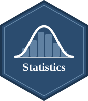

{width="130" style="float: right; margin: 0 0 1em 1.5em;" fig-alt="Statistics course hex badge"}

## Course Overview

Statistics (1) and Statistics (2) are sequential required offerings in the English Taught Program in International Business (ETP) at Shih Chien University, taught by [Yu-You Liou](https://yyliou.github.io). Together, they provide a comprehensive introduction to statistical reasoning and quantitative analysis.

The required textbook is *Elementary Statistics: A Step-by-Step Approach* (8th ed.) by Allan G. Bluman (McGraw-Hill, 2012). Statistics (1) covers Chapters 1–7 (descriptive statistics, probability, and the foundations of inference), and Statistics (2) covers Chapters 8–12 (hypothesis testing, regression, chi-square tests, and ANOVA).

Each course follows the same structure: a **lecture** hour for conceptual foundations and a **lab** hour for hands-on in-class exercises.

## Assessment

| Component          | Weight | Details                |
|:-------------------|:------:|:-----------------------|
| In-Class Exercises |  36%   | 12 exercises × 3% each |
| Midterm Exam       |  32%   |                        |
| Final Exam         |  32%   |                        |

## Exam Regulations

The examination is conducted online under the following regulations.

1.  **Mandatory Attendance** Students must take the exam in person. Roll call will be taken five minutes before the exam begins. Late arrival or absence will result in a score of zero.

2.  **Network Restriction** The exam system tracks IP addresses. You must use the campus Wi-Fi. Access from a non-campus IP address will result in a score of zero.

3.  **One Device Only** The exam must be taken on a single device. Keeping any additional device, such as a phone or a tablet, available during the exam will result in a score of zero.

4.  **Authorized Resources** This is an open-book exam. Printed reference materials are permitted without limit. Electronic reference materials and AI tools, such as ChatGPT or Gemini, are prohibited. Any use will result in a score of zero.

5.  **Media Prohibition** Photography, video or audio recording, and screenshotting are strictly prohibited. Violators will receive a score of zero.

6.  **No Communication or Disturbance** Interpersonal communication, causing noise or disruptive movements are strictly prohibited. Violators will receive a score of zero.

7.  **Copy-Paste Disabled** The exam system prohibits copying and pasting. Do not attempt to bypass this feature.

[Sample Link](https://yyliou.github.io/exam/index.html)

## Contact Me

Please feel free to contact me via [email](mailto:d10627008@ntu.edu.tw). However, to ensure fairness and consistency for all students, I will not respond to three categories of inquiries:

- Questions regarding **information that is already available** on the website

- Requests for **make-up** examination, assignment, or attendance adjustments

- Requests for **special arrangements** regarding examination schedules

Thank you for your understanding as we work to keep our learning environment fair for everyone.